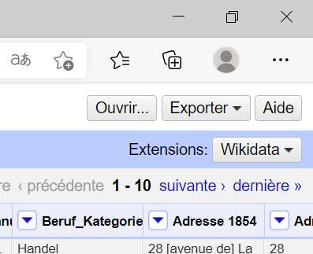
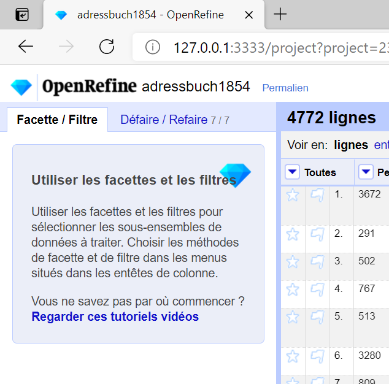
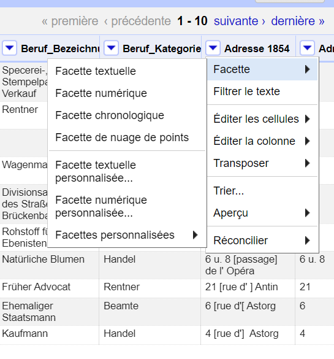
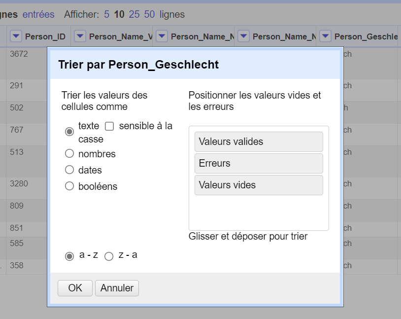
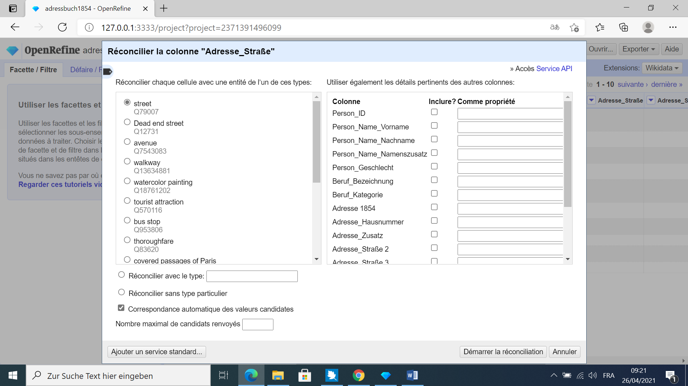
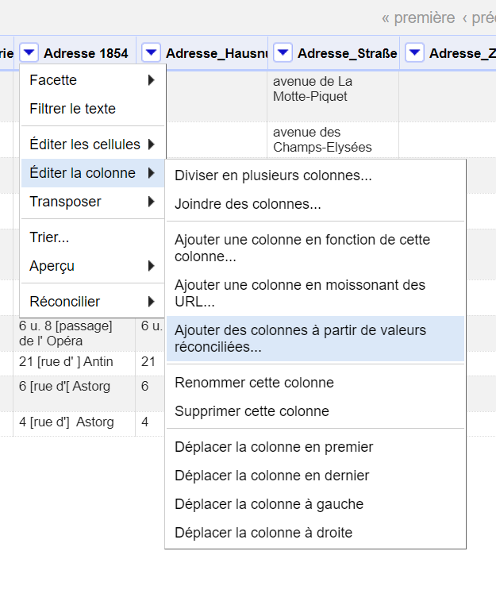

# Open Refine  

## _Logiciel libre pour le nettoyage et la mise en forme de données_

Ceci est un guide d´utilisation se basant sur mon expérience de l´utilisation d´Open Refine. Si vous souhaitez plus de précisions, Open Refine dispose d´une documentation 
précise pour la prise en main du logiciel à cette adresse : https://docs.openrefine.org/.

### Installation

Pour installer Open Refine, il faut aller à cette adresse : https://openrefine.org. Ensuite, vous allez dans la rubrique > **Downloads** et vous téléchargez le fichier zip.
Le fichier zip doit être ensuite décompressé. Vous ouvrez le dossier et vous cliquez sur openrefine. Une fenêtre invite de commande va s’ouvrir. 
**Vous devez gardez la fenêtre d’invite de commandes ouverte pour que Open Refine puisse fonctionner**. 
Vous patientez quelques instants et une fenêtre devrait s’ouvrir automatiquement sur la page d’accueil du logiciel.  

### Ouvrir un fichier

Sur la page d’accueil, vous avez la possibilité d’**Ouvrir un projet** si vous avez un projet en cours ou de > **Créer un projet** en important un fichier depuis votre ordinateur, 
depuis une base existante ou depuis un URL. Plusieurs formats sont acceptés, notamment Excel ou CSV.  
Vos projets s’enregistrent automatiquement, ce qui fait que lorsque vous ouvrez Open Refine, vous allez dans > **Ouvrir un projet** et vous retrouvez les projets sur lesquels vous travaillez.  
Si vous avez déjà un projet Open Refine vous pouvez l’utiliser avec > **Importer un projet** soit compressé ou décompressé.  
Si vous souhaitez changer la langue vous pouvez mais avant de débuter un projet, pendant vous ne pourrez pas. 
Il vous suffit d’aller dans > **Langue** et de choisir la langue qu’il vous convient.  
Lorsque vous importez un projet, vous avez quelques options si vous souhaitez modifier la disposition automatique des données réalisée par Open Refine. 
Selon le type de format que vous avez CSV, Excel ou autres, différents paramètres s´offrent à vous. 
Exemple, si vous importez un fichier CSV, par définition, il va séparer vos colonnes par un mode personnalise mais pour pouvez choisir de les séparer par tabulation ou par virgule,
le mode personnalise reste le meilleur choix pour l´affichage de la table. 
Une fois avoir défini vos paramètres d´affichage vous pouvez renommer le projet si vous souhaitez et sélectionnez à nouveau > **Créer un projet**.

### Utilisation

Si tout se passe bien votre projet est créé, il s´affiche devant vous avec les colonnes, le nombres de lignes dans sa totalité ainsi que les données. 
A droite, vous avez deux colonnes. La première, > Facette/Filtre elle vous permet de voir les filtres que vous avez mis en place ainsi que les facettes qui sont activées 
pour le nettoyage de données de la colonne que vous avez choisi. La seconde colonne est > Défaire/Refaire comme son nom l´indique, elle permet d´annuler les actions 
que vous avez faites ou d´enregistrer les actions que vous avez faites pour exécuter les mêmes actions sur d´autres fichiers ou à nouveau sur le même fichier. 
Elles sont enregistrées sous le format JSON. A votre droite vous avez 3 boutons : > ouvrir pour ouvrir un autre fichier, > exporter pour enregistrer votre fichier sous d´autres
formats notamment SQL, Excel, CSV, table HTML ou encore archiver le projet dans le google drive. Enfin, le bouton d´aide et celui des extensions en dessous, 
son extension par default est le Wikidata.  

 

### Facette

L´outil facette va vous permettre de nettoyer vos données. 
Par exemple, il peut vous permettre d´identifier des groupes de cellules ayant des valeurs différentes mais qui peuvent correspondre à une seule et même valeur. 
Exemple = New York / new-york ces deux valeurs sont écrites différemment mais elles veulent dire la même chose. 
On utilise > **Facette textuelle** pour du texte comme des noms, adresses, > **Facette numériques** pour des chiffres, > **Facette Chronologique** pour des dates.  
Quand Open Refine détermine que les données sont des chiffres ou des dates ils seront en vert dans le tableau, autrement ils seront noirs.

### Filtrer le texte

Sur les colonnes contenant du texte vous disposez d´une fonction > **Filtrer le texte** qui apparait sous la forme d´une barre de recherche à droite dans > **Facette/Filtre**, 
cette fonction vous permet d´isoler une ou plusieurs lignes de votre document. 

### Trier...

La fonction > **Trier** permet de choisir de quelle façon vous souhaitez organiser vos données, pour le texte ce sera dans l´ordre alphabétique, pour les nombres en ordre croissant ou décroissant, 
les dates chronologique ou antichronologique et les booléens également. 

### Réconcilier

Réconcilier les cellules nous permet d’enrichir les données avec une base de données externe. Cela permet par la suite d’ajouter des données. 
Je prends l’exemple du projet adressbuch avec les adresses des personnes vivant en 1854, j’ai pu enrichir mes données avec la fiche wikidata pour chaque rue 
puis par la suite ajouter les coordonnées GPS dans de nouvelles colonnes pour avoir ces informations en plus dans mon tableau de données.  

Pour procéder à la réconciliation de données, vous cliquez sur la flèche à côté du nom de la catégorie (comme pour aller dans facette, filtre ou trier), 
vous sélectionnez > Réconciliation puis > Démarrer la réconciliation. Une fenêtre s’ouvre pour choisir votre source externe de données. 
Par default, Open Refine intègre Wikidata comme source de données externe mais vous pouvez intégrer d’autres sources de réconciliation comme Integrated Authority File (IAF) 
ou des Thésaurus.  
Les sources de réconciliation sont disponibles à cette adresse : https://reconciliation-api.github.io/testbench/ . 
Open Refine détecte automatiquement ce que vous souhaitez réconcilier. 
Dans le cas de adressbuch, un champ « street» est déjà présélectionné.  

Ensuite vous n’avez plus qu’à lancer la réconciliation qui prend plus ou moins de temps selon la quantité de donner que vous souhaitez réconcilier. Une fois qu’Open Refine a fini son processus automatique, vous sélectionnez à nouveau > **Réconciliation** > **Facette** > **Type d’action de jugement**.  Une fenêtre s’ouvrira dans **Facette** qui vous permet de voir ce qui a été fait au niveau de la réconciliation.  
Vous avez 3 catégories d’affichées : **Matched** pour les données qui ont été réconciliés automatiquement ; **Unconcilied** les données ne sont pas réconciliés, vous devez rechercher la donnée que vous souhaitez ajouter parmi une liste proposée souvent ; **Unknown** Les données sont inconnus souvent dû à une erreur dans la donnée (faute d’orthographe ou un espace en trop) et vous devez rechercher vous-même la donnée pour la réconcilier en cliquant sur > **chercher une correspondance** qui doit apparaître dans la case de donnée qui considère inconnue. 

Si vous souhaitez ajouter des données et qu’ils apparaissent dans votre tableau vous allez dans la colonne que vous avez réconciliée puis : > **éditer la colonne** > **ajouter des colonnes à partir de valeurs réconciliées**. Une fenêtre s’ouvre et vous propose une liste de propriété ainsi qu’une barre de recherche pour rechercher les propriétés que vous souhaitez.  
Dans le cas de adressbuch, il fallait les coordonnées géographiques de chaque adresse. Il faut se diriger dans la barre de recherche saisir coordinate location et le sélectionner. Une nouvelle colonne apparait pour les coordonnées géographiques, cliquez sur > **ok** et la colonne apparait à côté de celle réconciliée. 

